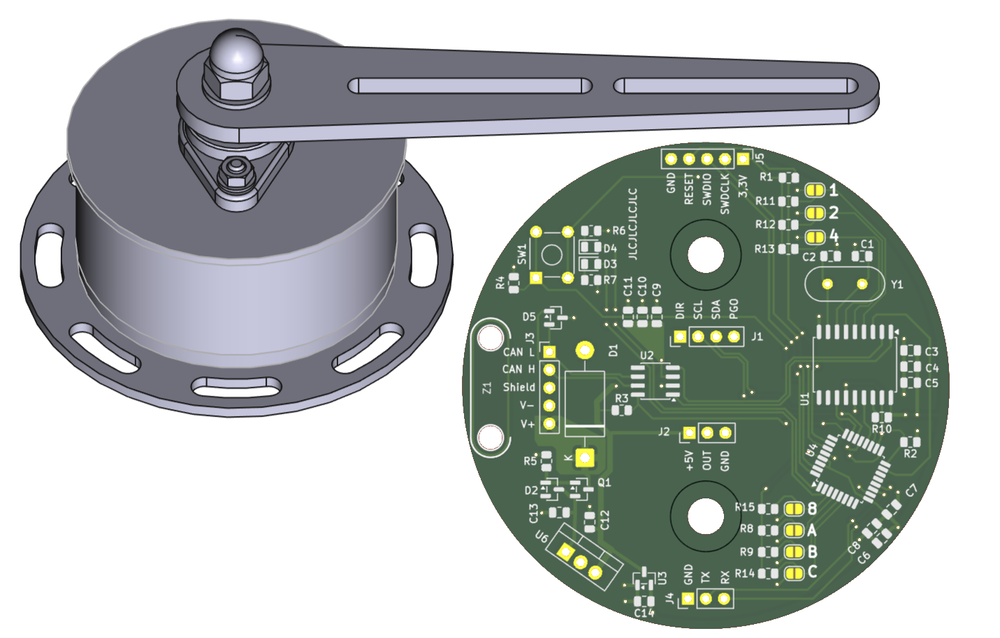
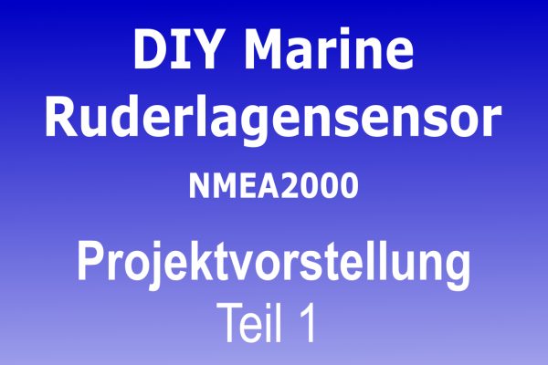

## RuderlagenGeber NMEA 2000
Sensor im Eigenbau mit N2K Schnittstelle.

### Mechanischer Aufbau
Durch die Verwendung von Aluminium Blechteilen und Normteilen wird 
ein preisgünstigen Aufbau ermöglicht.\
Die Positionserfassung erfolgt magnetisch verschleissfrei und wird über 360°,\
ohne Anschlag erfasst. Eine mechanische Ausrichtung des Gebers ist nicht notwendig.
Über einen Taster wird die 0° Grad Position festgelegt und\
es kann eine Drehrichtungsumkehr eingeschaltet werden.

### Elektronik
Die Schaltung ist gegen Verpolung und Spannungspitzen geschützt und
besteht im wesentlichen aus drei Komponenten:
Dem Positionssensor AS5600\
einem CAN BUS Controller MCP2515\
und dem Kontroller SAMD21G17.\
Die Spannungsregelung wird energiesparend über einen Schaltregler geregelt. 
 
### Firmware
Im Testmode werden über die RS232 TTL verschiedene Zustände und Messwerte angezeigt,
auch ohne Ausgabe der Werte ist es mit Hilfe der LED möglich den Abstand des Magnetsensors
ausreichend genau einzustellen. 

### Vorstellung des Projekts auf YouTube
Eine Video Unterstützung auf YouTube steht zur weiteren Unterstützung bereit.

###Lizenz
Alle Zeichnungen und der Programmcode können frei, nicht kommerziell, verwendet werden.
creative commons (CC BY-NC 4.0)
https://creativecommons.org/licenses/
